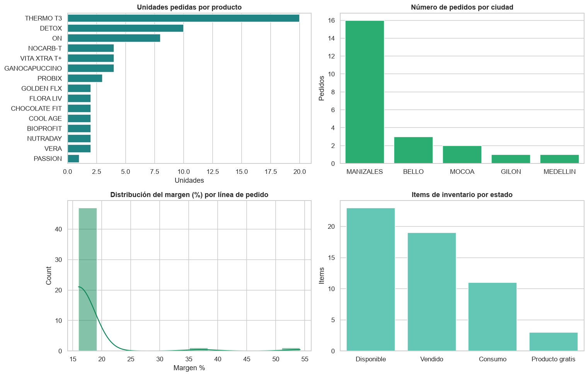
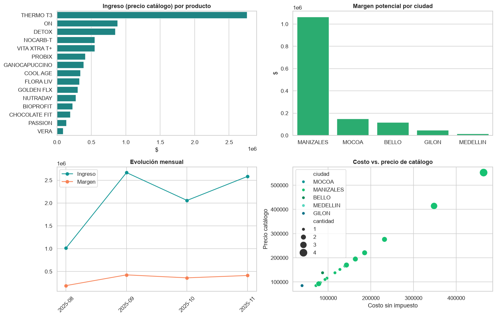
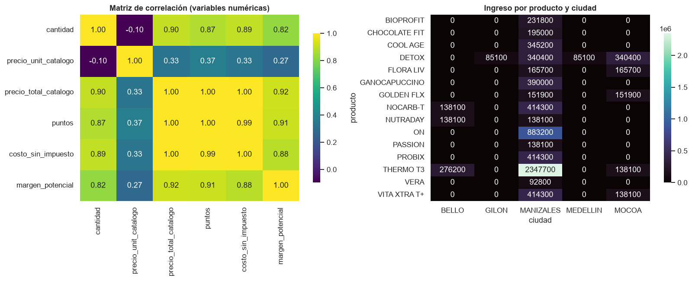
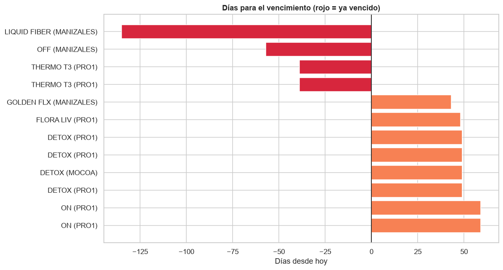
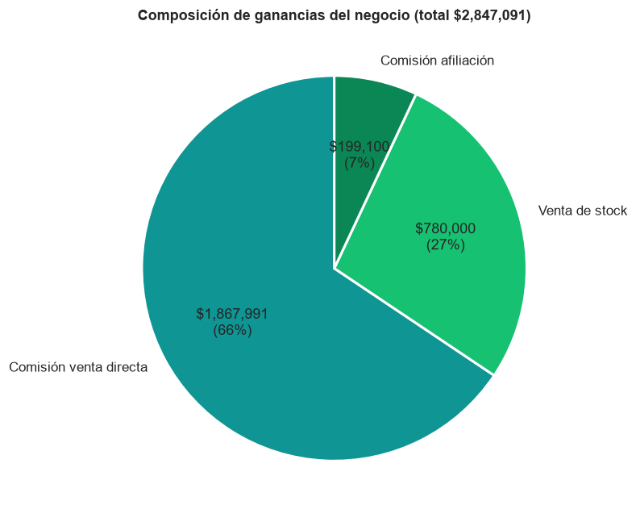

# Analisis de datos para la transformacion productiva de un emprendimiento de bienestar

### Proyecto Final · Inteligencia Artificial — Nivel Explorador (TalentoTech)

**Linea tematica:** transformacion productiva mediante ciencia y tecnologia  
**Caso de estudio:** emprendimiento de productos de bienestar (Fuxion)

> Datos del estudiante/grupo, documento, docente y fecha: completar en la portada.

---

# Resumen ejecutivo

Este documento desarrolla las primeras fases del ciclo de vida de un proyecto de Machine Learning aplicadas a los datos reales de 2025 de un emprendimiento de productos de bienestar (Fuxion). A partir de un libro de Excel mantenido manualmente, se construyo un proceso reproducible —documentado paso a paso con el codigo— de carga, evaluacion de calidad, limpieza, tratamiento de datos ausentes, anonimizacion, normalizacion y analisis exploratorio (univariado, bivariado y multivariado).

El objetivo es responder la pregunta central del negocio: que productos, ciudades y momentos concentran la mayor rentabilidad, para tomar decisiones informadas y dejar la base lista para un futuro modelo predictivo.

- 23 pedidos analizados, 68 unidades, 15 productos en 5 ciudades.
- Ingreso a precio de catalogo: $8.319.600 — margen potencial 16,7%.
- Ticket promedio por pedido: $361.722.
- Capital inmovilizado en inventario disponible: $2.423.300 (con productos ya vencidos).
- Ganancia total del negocio en 2025: $2.847.091 (todas las fuentes).

# 1. Introduccion teorica: el ciclo de vida de un proyecto de ML

Un proyecto de Machine Learning no comienza programando algoritmos, sino entendiendo el problema y los datos. La metodologia CRISP-DM (Cross Industry Standard Process for Data Mining) organiza ese ciclo en seis fases:

- Comprension del negocio: definir el problema y los objetivos.
- Comprension de los datos: recolectar y explorar las fuentes disponibles.
- Preparacion de los datos: limpiar, transformar y normalizar.
- Modelado: entrenar algoritmos de aprendizaje.
- Evaluacion: medir el desempeno del modelo.
- Despliegue: poner el modelo en produccion.

El analisis exploratorio de datos (EDA) es el nucleo de las fases 1 a 3: mediante estadistica descriptiva y visualizacion busca patrones, tendencias, relaciones y anomalias. Este trabajo, de Nivel Explorador, abarca precisamente las fases 1, 2 y 3, dejando los datos comprendidos y preparados para un futuro modelo.

# 2. Seleccion del contexto y problema

El caso es un emprendimiento real de distribucion de productos de bienestar (marca Fuxion) que combina varias fuentes de ingreso: reventa de productos (margen sobre el precio de catalogo), comision por venta directa, comision por afiliacion de nuevas personas a la red, y venta de inventario en distintas ciudades.

Problema detectado: las decisiones de compra de inventario, precios, enfoque geografico y crecimiento de la red se toman de forma intuitiva, sin apoyo en los datos historicos. Esto genera capital inmovilizado, riesgo de vencimiento de productos y desconocimiento de la rentabilidad real.

> Pregunta de negocio: ¿Que productos, ciudades y momentos concentran la mayor rentabilidad, y que decisiones permitirian maximizar las ganancias del emprendimiento?

# 3. Identificacion de datos y stakeholders

Stakeholders (partes interesadas): la emprendedora o duena del negocio (decisiones de compra y enfoque), la red de afiliados (que planes y productos funcionan mejor), los clientes finales (disponibilidad de los productos que demandan) y el analista de datos (convertir los registros en decisiones).

Fuente de datos: un libro de Excel de gestion (seguimiento_fuxion_2025.xlsx) con 10 hojas que cubren pedidos, inventario por ciudad, ventas directas, afiliaciones, gastos y un resumen de ganancias.

> Privacidad: los datos contienen nombres reales de clientes. En este proyecto se anonimizan (se reemplazan por identificadores) y se elimina el texto libre con datos personales antes de publicar cualquier resultado.

# 4. Metodologia y desarrollo del codigo

Toda la preparacion y el analisis se realizaron en Python (pandas y numpy) dentro de un Jupyter Notebook. A continuacion se documenta el codigo por etapas, con la explicacion de cada decision.

## 4.1 Entorno de trabajo y carga de datos

Se importan las librerias, se define un estilo visual consistente y se localiza automaticamente la raiz del proyecto para que el notebook funcione tanto desde la raiz como desde la carpeta de notebooks.


```python
import pandas as pd
import numpy as np
import re, json, os, unicodedata
from pathlib import Path
import matplotlib.pyplot as plt
import seaborn as sns

# Estilo visual consistente
sns.set_theme(style="whitegrid")
PALETA = ["#0E9594", "#16C172", "#0A8754", "#54D6BE", "#077187", "#9BC53D", "#F2C14E", "#F78154"]
sns.set_palette(PALETA)
plt.rcParams["figure.figsize"] = (9, 5)
plt.rcParams["axes.titleweight"] = "bold"
pd.set_option("display.max_columns", 40)

# Localizar la raíz del proyecto (funciona desde la raíz o desde notebooks/)
BASE = Path.cwd()
while not (BASE / "data").exists() and BASE != BASE.parent:
    BASE = BASE.parent
RAW  = BASE / "data" / "raw" / "seguimiento_fuxion_2025.xlsx"
PROC = BASE / "data" / "processed"; PROC.mkdir(parents=True, exist_ok=True)
DOCS = BASE / "docs" / "data";      DOCS.mkdir(parents=True, exist_ok=True)
FIG  = BASE / "informe" / "figuras"; FIG.mkdir(parents=True, exist_ok=True)
HOY  = pd.Timestamp("2026-06-13")
print("Proyecto en:", BASE)
print("Archivo de datos:", RAW.name, "->", "encontrado" if RAW.exists() else "NO encontrado")
```
*Configuracion del entorno y rutas del proyecto.*

Se cargan todas las hojas del libro y se cuenta cuantas filas con datos tiene cada una, para tener una vision general de las fuentes disponibles.


```python
# Vista general de todas las hojas del libro
xls = pd.ExcelFile(RAW)
print("El libro contiene", len(xls.sheet_names), "hojas:\n")
for sh in xls.sheet_names:
    n = pd.read_excel(RAW, sheet_name=sh, header=None).dropna(how="all").shape[0]
    print(f"  • {sh:18s} ~{n} filas con datos")
```
*Inventario de hojas del libro de Excel.*

## 4.2 Evaluacion de la calidad de los datos

Al ser un libro mantenido manualmente, presenta los problemas tipicos de los datos del mundo real. Se inspecciona la hoja principal de pedidos para evidenciarlos. Por privacidad, en la vista se ocultan las columnas con nombres de clientes.


```python
crudo = pd.read_excel(RAW, sheet_name="PEDIDOS FUXION", header=1)
print("Dimensiones en crudo:", crudo.shape)
# Mostramos un subconjunto de columnas que evidencia los problemas de calidad
# (celdas combinadas, encabezados/subtotales) SIN exponer datos personales de clientes.
cols_demo = ["PEDIDO","PERIODO","SEMANA","FECHA PEDIDO","PRODUCTO","CANTIDAD",
             "PRECIO SIN IMPUESTO","COSTOS ADICIONALES","CIUDAD DEL PEDIDO"]
crudo_demo = crudo.rename(columns={crudo.columns[0]: "PEDIDO"})
crudo_demo[[c for c in cols_demo if c in crudo_demo.columns]].head(10)
```
*Inspeccion de la hoja de pedidos en crudo (sin exponer datos personales).*

Problemas detectados: (1) celdas combinadas que dejan valores NaN; (2) encabezados repetidos entre bloques de pedidos; (3) filas de subtotales mezcladas con el detalle; (4) nombres de productos inconsistentes (NOCARB-T / NOCARBO-T, VITA XTRA T / VITA XTRA T+, KIT DETOX / DETOX); (5) ciudades inconsistentes (MANIZALES / MANIZALEZ); (6) valores monetarios escritos como texto; (7) datos personales de clientes.

## 4.3 Funciones de normalizacion y anonimizacion

Se definen utilidades reutilizables para estandarizar texto, unificar nombres de productos y ciudades, convertir valores a numero y anonimizar nombres reemplazandolos por identificadores estables.


```python
def limpiar_texto(s):
    """Mayúsculas, sin espacios sobrantes."""
    if pd.isna(s):
        return np.nan
    return re.sub(r"\s+", " ", str(s).strip().upper())

def sin_tildes(s):
    s = s.replace("Ñ", "N")
    return "".join(c for c in unicodedata.normalize("NFD", s) if unicodedata.category(c) != "Mn")

# Diccionario de unificación de nombres de productos
MAPA_PRODUCTOS = {
    "NOCARBO-T": "NOCARB-T", "NOCARB -T": "NOCARB-T",
    "GANOMAS CAPUCCINO": "GANOCAPUCCINO", "GANOMAS CAPPUCCINO": "GANOCAPUCCINO",
    "VITA XTRA T": "VITA XTRA T+", "VITA XTRA T +": "VITA XTRA T+",
    "KIT DETOX": "DETOX", "ALFA BALANCE": "ALPHA BALANCE", "FLORALIV": "FLORA LIV",
}
def norm_producto(s):
    s = limpiar_texto(s)
    if pd.isna(s):
        return np.nan
    base = re.sub(r"\s+", " ", sin_tildes(s)).strip()
    if base.startswith("VERA"):
        return "VERA"
    return MAPA_PRODUCTOS.get(base, base)

MAPA_CIUDAD = {"MANIZALEZ": "MANIZALES", "GILON SANTANDER": "GILON"}
def norm_ciudad(s):
    s = limpiar_texto(s)
    if pd.isna(s):
        return np.nan
    s = sin_tildes(s.split(",")[0].strip())
    return MAPA_CIUDAD.get(s, s)

def a_numero(serie):
    """Convierte a número; lo no convertible queda como NaN."""
    return pd.to_numeric(serie, errors="coerce")

def anonimizar(serie, prefijo="Cliente"):
    """Reemplaza nombres por identificadores estables (Cliente_001, ...)."""
    unicos = sorted(serie.dropna().map(limpiar_texto).unique())
    mapa = {n: f"{prefijo}_{i+1:03d}" for i, n in enumerate(unicos)}
    return serie.map(lambda x: mapa.get(limpiar_texto(x), np.nan) if pd.notna(x) else np.nan)

print("Funciones de limpieza listas.")
```
*Funciones de limpieza, normalizacion de categorias y anonimizacion.*

## 4.4 Limpieza de los pedidos

El reto principal es reconstruir las lineas de pedido a partir de los bloques con celdas combinadas. La estrategia: eliminar los encabezados repetidos; asignar un identificador de pedido (cada pedido trae su numero de orden en la primera linea); propagar (forward-fill) los datos a nivel de pedido dentro de cada bloque; y conservar solo las filas con un producto real, descartando los subtotales.


```python
def cargar_pedidos():
    frames = []
    # --- Hoja principal de pedidos ---
    df = pd.read_excel(RAW, sheet_name="PEDIDOS FUXION", header=1)
    df = df.rename(columns={df.columns[0]: "BLOQUE"})
    df = df[df["PRODUCTO"].astype(str).str.upper() != "PRODUCTO"].reset_index(drop=True)
    df["order_id"] = a_numero(df["N. ORDEN"]).notna().cumsum()
    nivel_pedido = ["PERIODO","SEMANA","FECHA PEDIDO","N. FACTURA","N. ORDEN",
                    "CIUDAD DEL PEDIDO","FECHA LLEGADA PEDIDO"]
    for c in nivel_pedido:
        df[c] = df.groupby("order_id")[c].ffill()
    df["origen"] = "Pedidos Fuxion"
    frames.append(df)

    # --- Hoja de pedidos de la línea PRO1 ---
    df2 = pd.read_excel(RAW, sheet_name="PRO1- PERIODO 11", header=0)
    df2 = df2.rename(columns={df2.columns[0]: "BLOQUE"})
    df2 = df2[df2["PRODUCTO"].astype(str).str.upper() != "PRODUCTO"].reset_index(drop=True)
    df2["order_id"] = a_numero(df2["N. ORDEN"]).notna().cumsum() + 1000
    for c in nivel_pedido:
        if c in df2.columns:
            df2[c] = df2.groupby("order_id")[c].ffill()
    df2["origen"] = "Pro1"
    frames.append(df2)

    # --- Construir tabla de líneas de producto ---
    regs = []
    for d in frames:
        m = d["PRODUCTO"].notna() & (d["PRODUCTO"].astype(str).str.strip() != "")
        s = d[m]
        regs.append(pd.DataFrame({
            "order_id": s["order_id"], "origen": s["origen"],
            "periodo": a_numero(s["PERIODO"]), "semana": a_numero(s["SEMANA"]),
            "fecha_pedido": pd.to_datetime(s["FECHA PEDIDO"], errors="coerce"),
            "producto": s["PRODUCTO"].map(norm_producto),
            "cantidad": a_numero(s["CANTIDAD"]),
            "precio_unit_catalogo": a_numero(s["VALOR UND PRECIO CATALOGO + IMPUESTO"]),
            "precio_total_catalogo": a_numero(s["TOTAL PRECIO CATALOGO + IMPUESTO"]),
            "puntos": a_numero(s["PUNTOS"]),
            "costo_sin_impuesto": a_numero(s["PRECIO SIN IMPUESTO"]),
            "ciudad": s["CIUDAD DEL PEDIDO"].map(norm_ciudad),
        }))
    ped = pd.concat(regs, ignore_index=True)
    ped = ped[ped["producto"].notna() & ped["cantidad"].notna() & (ped["cantidad"] > 0)]
    # Completar precio total faltante con unitario * cantidad
    falta = ped["precio_total_catalogo"].isna() & ped["precio_unit_catalogo"].notna()
    ped.loc[falta, "precio_total_catalogo"] = ped.loc[falta, "precio_unit_catalogo"] * ped.loc[falta, "cantidad"]
    # Margen potencial por reventa a precio de catálogo
    ped["margen_potencial"] = ped["precio_total_catalogo"] - ped["costo_sin_impuesto"]
    ped["margen_pct"] = (ped["margen_potencial"] / ped["precio_total_catalogo"] * 100).round(1)
    ped["mes"] = ped["fecha_pedido"].dt.to_period("M").astype(str)
    return ped.reset_index(drop=True)

pedidos = cargar_pedidos()
print("Líneas de pedido limpias:", pedidos.shape)
pedidos.head()
```
*Reconstruccion de las lineas de pedido (de 110 filas desordenadas a una tabla ordenada).*

## 4.5 Limpieza del inventario

Se unifican las tres hojas de inventario (Manizales, Mocoa y PRO1) en una sola tabla; se deriva el estado de cada producto (Vendido, Consumo, Disponible, Producto gratis) y los dias para su vencimiento. Por privacidad, la columna de observaciones (texto libre con nombres de personas) se descarta tras extraer el estado.


```python
def cargar_inventario():
    fuentes = [("STOCK MANIZALES", 2, "MANIZALES"), ("STOCK MOCOA", 2, "MOCOA"), ("PROD STOCK PRO1", 1, "PRO1")]
    out = []
    for hoja, h, ubic in fuentes:
        d = pd.read_excel(RAW, sheet_name=hoja, header=h)
        d.columns = [limpiar_texto(c) for c in d.columns]
        ren = {}
        for c in d.columns:
            cs = str(c)
            if "FECHA DE PEDIDO" in cs or "FECHA DE COMPRA" in cs: ren[c] = "fecha_compra"
            elif "VENCIMIENTO" in cs: ren[c] = "fecha_vencimiento"
            elif "FECHA DE VENTA" in cs: ren[c] = "fecha_venta"
            elif c == "PRODUCTO": ren[c] = "producto"
            elif c == "CANTIDAD": ren[c] = "cantidad"
            elif c == "VALOR": ren[c] = "valor"
            elif "OBSERVACI" in cs: ren[c] = "observaciones"
            elif "VENTA STOCK" in cs or c == "$": ren[c] = "venta_valor"
        d = d.rename(columns=ren)
        d = d[d["producto"].notna()].copy()
        d["producto"] = d["producto"].map(norm_producto)
        d["ubicacion"] = ubic
        for fc in ["fecha_compra","fecha_vencimiento","fecha_venta"]:
            if fc in d.columns: d[fc] = pd.to_datetime(d[fc], errors="coerce")
        d["valor"] = a_numero(d.get("valor"))
        d["cantidad"] = a_numero(d.get("cantidad")).fillna(1)
        cols = [c for c in ["producto","cantidad","ubicacion","fecha_compra",
                "fecha_vencimiento","fecha_venta","valor","observaciones"] if c in d.columns]
        out.append(d[cols])
    inv = pd.concat(out, ignore_index=True)

    def estado(row):
        o = "" if pd.isna(row.get("observaciones")) else sin_tildes(str(row["observaciones"]).lower())
        if "consumo" in o: return "Consumo"
        if "gratis" in o: return "Producto gratis"
        if "vender" in o and pd.isna(row.get("fecha_venta")): return "Disponible"
        if pd.notna(row.get("fecha_venta")) or "vendi" in o or "vendido" in o: return "Vendido"
        return "Disponible"
    inv["estado"] = inv.apply(estado, axis=1)
    inv["dias_para_vencer"] = (inv["fecha_vencimiento"] - HOY).dt.days
    # 🔐 Privacidad: la columna de observaciones es texto libre que contiene nombres de
    # personas; tras derivar el estado la descartamos para no exponer datos personales.
    inv = inv.drop(columns=["observaciones"])
    return inv

inventario = cargar_inventario()
print("Items de inventario:", inventario.shape)
inventario.head()
```
*Unificacion del inventario, derivacion del estado y dias para vencer.*

## 4.6 Venta directa, afiliaciones e ingresos

Se limpian las comisiones por venta directa, las afiliaciones (anonimizando los nombres) y se extrae la composicion de ganancias desde la hoja de resumen.


```python
# --- Venta directa ---
vd = pd.read_excel(RAW, sheet_name="VENTA DIRECTA", header=1)
vd = vd.rename(columns={"$ TOTAL RECIBIDO":"total_recibido","CP":"cliente","PERIODO":"periodo",
                        "SEMANA":"semana","Unnamed: 7":"ganancia_tier"})
vd = vd[vd["No."].notna()].copy()
vd["total_recibido"] = a_numero(vd["total_recibido"])
vd["periodo"] = a_numero(vd["periodo"])
vd["ganancia_tier"] = vd["ganancia_tier"].map(limpiar_texto)
vd["cliente_id"] = anonimizar(vd["cliente"], "Cliente")   # anonimización
venta_directa = vd[["No.","periodo","semana","total_recibido","ganancia_tier","cliente_id"]].rename(columns={"No.":"n"})

# --- Afiliaciones ---
af = pd.read_excel(RAW, sheet_name="AFILIACIONES", header=1)
af = af.rename(columns={"NOMBRES Y APELLIDOS":"nombre","FECHA AFILIACION":"fecha_afiliacion",
                        "PERIODO":"periodo","SEMANA":"semana","PLAN":"plan",
                        "PUNTOS DEL PLAN":"puntos", af.columns[-1]:"comision"})
af = af[af["N"].notna()].copy()
af["afiliado_id"] = anonimizar(af["nombre"], "Afiliado")  # anonimización
af["fecha_afiliacion"] = pd.to_datetime(af["fecha_afiliacion"], errors="coerce")
afiliaciones = af[["afiliado_id","fecha_afiliacion","periodo","semana","plan","puntos","comision"]]

# --- Ingresos (hoja TOTAL) ---
tot = pd.read_excel(RAW, sheet_name="TOTAL", header=None)
def buscar_total(txt):
    for _, r in tot.iterrows():
        if isinstance(r[0], str) and txt in sin_tildes(r[0].lower()):
            return float(r[1])
    return None
ingresos = pd.DataFrame([
    {"fuente":"Comisión venta directa", "valor": buscar_total("comision venta")},
    {"fuente":"Venta de stock",         "valor": buscar_total("venta stock")},
    {"fuente":"Comisión afiliación",    "valor": buscar_total("comision afiliacion")},
])
print("Venta directa:", venta_directa.shape, "| Afiliaciones:", afiliaciones.shape)
display(afiliaciones)
display(ingresos)
```
*Limpieza de venta directa, afiliaciones e ingresos.*

## 4.7 Tratamiento de datos ausentes

Tras la limpieza se revisan los valores ausentes. Los NaN originados por celdas combinadas se completaron por propagacion; los ausentes legitimos (por ejemplo, la fecha de venta de un producto aun en stock) se conservan porque representan informacion real del negocio. No se imputa a ciegas.


```python
faltantes = pedidos.isna().sum()
print("Valores ausentes por columna (pedidos):")
print(faltantes[faltantes > 0] if faltantes.sum() else "✅ Sin valores ausentes en la tabla de pedidos.")
print("\nValores ausentes en inventario:")
print(inventario.isna().sum())
```
*Verificacion de valores ausentes por columna.*

## 4.8 Anonimizacion de datos personales

Los nombres de clientes y afiliados son datos personales; se reemplazan por identificadores irreversibles conservando la utilidad analitica sin exponer identidades.


```python
print("Ejemplo de anonimización en afiliaciones (la columna de nombre ya no existe):")
print("Columnas publicables:", list(afiliaciones.columns))
print("\nIdentificadores generados en venta directa:")
print(venta_directa["cliente_id"].dropna().unique()[:8])
```
*Demostracion de la anonimizacion aplicada.*

## 4.9 Normalizacion

Se distinguen dos tipos de normalizacion: la de categorias (unificacion de nombres de productos y ciudades, ya aplicada) y la de variables numericas (escala Min-Max a rango 0-1) para poder compararlas en el analisis multivariado.


```python
print("Productos unificados ({}):".format(pedidos["producto"].nunique()))
print(", ".join(sorted(pedidos["producto"].unique())))
print("\nCiudades unificadas ({}):".format(pedidos["ciudad"].nunique()))
print(", ".join(sorted(pedidos["ciudad"].unique())))

# Normalización Min-Max de variables numéricas clave
num_cols = ["cantidad","precio_unit_catalogo","precio_total_catalogo","puntos","costo_sin_impuesto","margen_potencial"]
norm = pedidos[num_cols].copy()
norm = (norm - norm.min()) / (norm.max() - norm.min())
norm.describe().round(2)
```
*Verificacion de categorias unificadas y normalizacion Min-Max.*


---

# 5. Resultados del analisis exploratorio

## 5.1 Analisis univariado

Se estudia cada variable por separado para entender su distribucion.


```python
fig, axes = plt.subplots(2, 2, figsize=(14, 9))

# Unidades por producto
top_prod = pedidos.groupby("producto")["cantidad"].sum().sort_values(ascending=False)
sns.barplot(x=top_prod.values, y=top_prod.index, ax=axes[0,0], color=PALETA[0])
axes[0,0].set_title("Unidades pedidas por producto"); axes[0,0].set_xlabel("Unidades"); axes[0,0].set_ylabel("")

# Pedidos por ciudad
ped_ciudad = pedidos.groupby("ciudad")["order_id"].nunique().sort_values(ascending=False)
sns.barplot(x=ped_ciudad.index, y=ped_ciudad.values, ax=axes[0,1], color=PALETA[1])
axes[0,1].set_title("Número de pedidos por ciudad"); axes[0,1].set_ylabel("Pedidos"); axes[0,1].set_xlabel("")

# Distribución del margen %
sns.histplot(pedidos["margen_pct"], bins=12, kde=True, ax=axes[1,0], color=PALETA[2])
axes[1,0].set_title("Distribución del margen (%) por línea de pedido"); axes[1,0].set_xlabel("Margen %")

# Inventario por estado
est = inventario["estado"].value_counts()
sns.barplot(x=est.index, y=est.values, ax=axes[1,1], color=PALETA[3])
axes[1,1].set_title("Items de inventario por estado"); axes[1,1].set_ylabel("Items"); axes[1,1].set_xlabel("")

plt.tight_layout(); plt.savefig(FIG/"univariado.png", dpi=110, bbox_inches="tight"); plt.show()
```
*Codigo de los graficos univariados.*



*Figura 1. Unidades por producto, pedidos por ciudad, distribucion del margen y estado del inventario.*

Lecturas: THERMO T3 domina la demanda en unidades, seguido por DETOX y ON; la operacion esta muy concentrada en Manizales; el margen por linea se agrupa alrededor del 16%; y el inventario combina productos vendidos, disponibles, de consumo propio y gratuitos.

## 5.2 Analisis bivariado

Se relacionan pares de variables para descubrir asociaciones.


```python
fig, axes = plt.subplots(2, 2, figsize=(14, 9))

# Ingreso por producto
ing_prod = pedidos.groupby("producto")["precio_total_catalogo"].sum().sort_values(ascending=False)
sns.barplot(x=ing_prod.values, y=ing_prod.index, ax=axes[0,0], color=PALETA[0])
axes[0,0].set_title("Ingreso (precio catálogo) por producto"); axes[0,0].set_xlabel("$"); axes[0,0].set_ylabel("")

# Margen por ciudad
mar_ciudad = pedidos.groupby("ciudad")["margen_potencial"].sum().sort_values(ascending=False)
sns.barplot(x=mar_ciudad.index, y=mar_ciudad.values, ax=axes[0,1], color=PALETA[1])
axes[0,1].set_title("Margen potencial por ciudad"); axes[0,1].set_ylabel("$"); axes[0,1].set_xlabel("")

# Evolución mensual del ingreso y el margen
por_mes = pedidos.groupby("mes").agg(ingreso=("precio_total_catalogo","sum"),
                                     margen=("margen_potencial","sum")).reset_index()
axes[1,0].plot(por_mes["mes"], por_mes["ingreso"], marker="o", label="Ingreso", color=PALETA[0])
axes[1,0].plot(por_mes["mes"], por_mes["margen"], marker="o", label="Margen", color=PALETA[7])
axes[1,0].set_title("Evolución mensual"); axes[1,0].legend(); axes[1,0].tick_params(axis="x", rotation=45)

# Costo vs precio de catálogo (cada punto = una línea de pedido)
sns.scatterplot(data=pedidos, x="costo_sin_impuesto", y="precio_total_catalogo",
                hue="ciudad", size="cantidad", sizes=(40,250), ax=axes[1,1])
axes[1,1].set_title("Costo vs. precio de catálogo"); axes[1,1].set_xlabel("Costo sin impuesto"); axes[1,1].set_ylabel("Precio catálogo")

plt.tight_layout(); plt.savefig(FIG/"bivariado.png", dpi=110, bbox_inches="tight"); plt.show()
```
*Codigo de los graficos bivariados.*



*Figura 2. Ingreso por producto, margen por ciudad, evolucion mensual y costo vs. precio.*

Lecturas: el ingreso confirma a THERMO T3 como motor del negocio; Manizales aporta la mayoria del margen; la serie mensual muestra los meses pico; y existe una relacion lineal estable entre costo y precio de catalogo (el margen porcentual es similar entre productos).

## 5.3 Analisis multivariado

Se analizan varias variables a la vez: correlaciones y la relacion producto x ciudad.


```python
fig, axes = plt.subplots(1, 2, figsize=(15, 6))

# Matriz de correlación
corr = pedidos[num_cols].corr()
sns.heatmap(corr, annot=True, fmt=".2f", cmap="viridis", ax=axes[0], cbar_kws={"shrink":.8})
axes[0].set_title("Matriz de correlación (variables numéricas)")

# Mapa de calor producto x ciudad (ingreso)
pivot = pedidos.pivot_table(index="producto", columns="ciudad",
                            values="precio_total_catalogo", aggfunc="sum", fill_value=0)
sns.heatmap(pivot, annot=True, fmt=".0f", cmap="mako", ax=axes[1], cbar_kws={"shrink":.8})
axes[1].set_title("Ingreso por producto y ciudad")

plt.tight_layout(); plt.savefig(FIG/"multivariado.png", dpi=110, bbox_inches="tight"); plt.show()
```
*Codigo de la matriz de correlacion y el mapa de calor.*



*Figura 3. Matriz de correlacion y mapa de calor de ingreso por producto y ciudad.*

Lecturas: las variables monetarias (precio, costo, margen, puntos) estan fuertemente correlacionadas entre si; el mapa de calor producto x ciudad revela que productos sostienen cada plaza y confirma la dependencia de Manizales como mercado principal.

## 5.4 Inventario y riesgo de vencimiento

Uno de los hallazgos mas accionables: el capital inmovilizado y los productos por vencer.


```python
disponible = inventario[inventario["estado"] == "Disponible"]
print(f"💰 Capital en inventario disponible: ${disponible['valor'].sum():,.0f}")
print(f"📦 Items disponibles: {len(disponible)}")

# Productos disponibles/gratuitos ordenados por cercanía al vencimiento
riesgo = inventario[inventario["estado"].isin(["Disponible","Producto gratis"])].copy()
riesgo = riesgo.dropna(subset=["fecha_vencimiento"]).sort_values("dias_para_vencer")

fig, ax = plt.subplots(figsize=(11, 6))
top = riesgo.head(12)
colores = ["#D7263D" if d < 0 else ("#F78154" if d < 90 else "#16C172") for d in top["dias_para_vencer"]]
ax.barh(range(len(top)), top["dias_para_vencer"], color=colores)
ax.set_yticks(range(len(top)))
ax.set_yticklabels([f"{p} ({u})" for p,u in zip(top["producto"], top["ubicacion"])])
ax.axvline(0, color="black", lw=1)
ax.set_title("Días para el vencimiento (rojo = ya vencido)")
ax.set_xlabel("Días desde hoy"); ax.invert_yaxis()
plt.tight_layout(); plt.savefig(FIG/"vencimientos.png", dpi=110, bbox_inches="tight"); plt.show()

vencidos = riesgo[riesgo["dias_para_vencer"] < 0]
print(f"\n🚨 Productos disponibles YA VENCIDOS: {len(vencidos)}  (capital: ${vencidos['valor'].sum():,.0f})")
display(vencidos[["producto","ubicacion","fecha_vencimiento","valor"]])
```
*Codigo del analisis de vencimientos.*



*Figura 4. Dias para el vencimiento por producto (en rojo, los ya vencidos).*

Hay $2.423.300 de capital en inventario disponible y productos que ya se vencieron sin venderse (Liquid Fiber, Off, Thermo T3), lo que representa una perdida directa de capital.

## 5.5 Composicion de los ingresos


```python
fig, ax = plt.subplots(figsize=(8, 6))
ing = ingresos.dropna()
ax.pie(ing["valor"], labels=ing["fuente"], autopct=lambda p: f"${p/100*ing['valor'].sum():,.0f}\n({p:.0f}%)",
       colors=PALETA[:3], startangle=90, wedgeprops={"edgecolor":"white","linewidth":2})
ax.set_title(f"Composición de ganancias del negocio (total ${ing['valor'].sum():,.0f})")
plt.tight_layout(); plt.savefig(FIG/"ingresos.png", dpi=110, bbox_inches="tight"); plt.show()
```
*Codigo de la composicion de ingresos.*



*Figura 5. Composicion de las ganancias del negocio por fuente.*

La comision por venta directa es la principal fuente de ganancia (66%), seguida por la venta de stock (27%); la afiliacion aun aporta poco (7%): una oportunidad de crecimiento.

## 5.6 Exportacion de datos para el tablero

Finalmente se guardan los datos limpios y anonimizados (CSV) y un archivo JSON con los agregados que alimentan el tablero interactivo publicado en GitHub Pages.


```python
# CSVs procesados (anonimizados)
pedidos.to_csv(PROC/"pedidos_lineas.csv", index=False, encoding="utf-8-sig")
inventario.to_csv(PROC/"inventario.csv", index=False, encoding="utf-8-sig")
venta_directa.to_csv(PROC/"venta_directa.csv", index=False, encoding="utf-8-sig")
afiliaciones.to_csv(PROC/"afiliaciones.csv", index=False, encoding="utf-8-sig")

def tabla(df, cols): return df[cols].to_dict(orient="records")

prod = pedidos.groupby("producto").agg(
    unidades=("cantidad","sum"), ingreso=("precio_total_catalogo","sum"),
    costo=("costo_sin_impuesto","sum"), margen=("margen_potencial","sum"),
    pedidos=("order_id","nunique")).reset_index()
prod["margen_pct"] = (prod["margen"]/prod["ingreso"]*100).round(1)
prod = prod.sort_values("ingreso", ascending=False)

ciu = pedidos.groupby("ciudad").agg(
    pedidos=("order_id","nunique"), unidades=("cantidad","sum"),
    ingreso=("precio_total_catalogo","sum"), margen=("margen_potencial","sum")).reset_index().sort_values("ingreso", ascending=False)

por_mes = pedidos.groupby("mes").agg(ingreso=("precio_total_catalogo","sum"),
    margen=("margen_potencial","sum"), unidades=("cantidad","sum"),
    pedidos=("order_id","nunique")).reset_index().sort_values("mes")

inv_estado = inventario.groupby("estado").agg(n=("producto","count"), valor=("valor","sum")).reset_index().sort_values("valor", ascending=False)
inv_ubic = inventario.groupby("ubicacion").agg(n=("producto","count"), valor=("valor","sum")).reset_index()
disp = inventario[inventario["estado"]=="Disponible"]
pv = inventario[inventario["estado"].isin(["Disponible","Producto gratis"])].dropna(subset=["fecha_vencimiento"]).sort_values("dias_para_vencer").head(10).copy()
pv["fecha_vencimiento"] = pv["fecha_vencimiento"].dt.strftime("%Y-%m-%d")

dashboard = {
  "generado": HOY.strftime("%Y-%m-%d"),
  "kpis": {
    "pedidos": int(pedidos["order_id"].nunique()),
    "unidades": int(pedidos["cantidad"].sum()),
    "productos_distintos": int(pedidos["producto"].nunique()),
    "ciudades": int(pedidos["ciudad"].nunique()),
    "ingreso_catalogo": float(pedidos["precio_total_catalogo"].sum()),
    "costo_total": float(pedidos["costo_sin_impuesto"].sum()),
    "margen_total": float(pedidos["margen_potencial"].sum()),
    "margen_pct_global": round(float(pedidos["margen_potencial"].sum()/pedidos["precio_total_catalogo"].sum()*100),1),
    "ticket_promedio": round(float(pedidos.groupby("order_id")["precio_total_catalogo"].sum().mean()),0),
    "items_inventario": int(inventario["cantidad"].sum()),
    "capital_disponible": float(disp["valor"].sum()),
    "ganancia_total_negocio": float(ingresos["valor"].dropna().sum()),
  },
  "productos": {"tabla": tabla(prod, ["producto","unidades","pedidos","ingreso","costo","margen","margen_pct"])},
  "ciudades": tabla(ciu, ["ciudad","pedidos","unidades","ingreso","margen"]),
  "tiempo": {"por_mes": tabla(por_mes, ["mes","ingreso","margen","unidades","pedidos"])},
  "inventario": {
    "por_estado": tabla(inv_estado, ["estado","n","valor"]),
    "por_ubicacion": tabla(inv_ubic, ["ubicacion","n","valor"]),
    "por_vencer": tabla(pv, ["producto","ubicacion","fecha_vencimiento","dias_para_vencer","valor"]),
    "capital_disponible": float(disp["valor"].sum()),
  },
  "ingresos": tabla(ingresos.dropna(), ["fuente","valor"]),
  "venta_directa": {
    "total": float(venta_directa["total_recibido"].sum()),
    "transacciones": int(venta_directa.shape[0]),
  },
  "afiliaciones": {
    "total": int(afiliaciones.shape[0]),
    "comision_total": float(a_numero(afiliaciones["comision"]).sum()),
    "puntos_total": int(a_numero(afiliaciones["puntos"]).sum()),
  },
}
with open(DOCS/"dashboard.json", "w", encoding="utf-8") as f:
    json.dump(dashboard, f, ensure_ascii=False, indent=2)
# Versión embebida en JS: permite abrir el tablero localmente sin servidor (file://)
with open(DOCS/"dashboard.js", "w", encoding="utf-8") as f:
    f.write("window.DASHBOARD = " + json.dumps(dashboard, ensure_ascii=False) + ";")
print("✅ Datos exportados a data/processed/, docs/data/dashboard.json y dashboard.js")
```
*Exportacion de datos procesados y del tablero.*

> Tablero interactivo publicado: https://landreams23.github.io/TalentoTech_IA/

# 6. Hallazgos y recomendaciones

**Hallazgos**

- Producto estrella: THERMO T3 lidera demanda, ingreso y presencia en pedidos.
- Alta dependencia geografica: Manizales concentra cerca del 80% de los ingresos.
- Margen estable (~16-20%): la rentabilidad se gana por volumen y rotacion, no por diferencias de margen.
- Capital en riesgo: hay inventario inmovilizado y productos ya vencidos sin vender.
- Ingresos concentrados en la comision por venta directa; la afiliacion esta subutilizada.

**Recomendaciones**

- Gestionar el inventario por vencimiento (FEFO): priorizar la venta de lo proximo a vencer y ajustar las compras a la rotacion real de cada producto.
- Reforzar los productos y la ciudad ganadores, pero diversificar geograficamente para reducir la dependencia de Manizales.
- Impulsar la afiliacion como fuente de ingreso recurrente y escalable.
- Institucionalizar el dato para construir, en una fase siguiente, un modelo predictivo de demanda.

# 7. Conclusiones

El analisis exploratorio cumple las fases 1 a 3 del ciclo de vida de Machine Learning y convierte un registro manual y desordenado en conocimiento accionable. El emprendimiento cuenta ahora con un diagnostico basado en evidencia y un tablero interactivo para el seguimiento continuo, sentando las bases para futuras fases de modelado predictivo de la demanda.

# Anexos

- Notebook del analisis: notebooks/analisis_fuxion.ipynb
- Tablero interactivo: https://landreams23.github.io/TalentoTech_IA/
- Repositorio: https://github.com/landreams23/TalentoTech_IA
- Datos procesados (anonimizados): carpeta data/processed/

Reproducir el analisis y regenerar las graficas: crear el entorno (python -m venv .venv), instalar requirements.txt y ejecutar el notebook (Kernel > Restart & Run All). Las figuras se guardan en informe/figuras/ y los datos del tablero en docs/data/.
